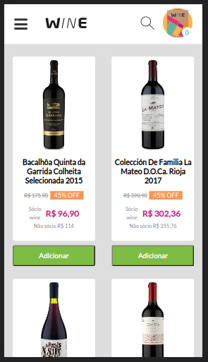

<h1 align="center">
   Vize job test
</h1>

<h3 align="center">
    A React app that uses an API to create a wine shop
</h3>

<p align="center">
  

  
  
  <a href="https://github.com/ricknois/wine-job-test/commits/master">
    
  </a>

  <a href="https://ricknois.github.io/">
    
  </a>
  
<h4 align="center">
  Status: Finished
</h4>

<p align="center">
 <a href="#about">About</a> •
 <a href="#features">Features</a> •
 <a href="#layout">Layout</a> •
 <a href="#tech-stack">Tech Stack</a> •
 <a href="#author">Author</a> •

</p>

## About

Wine job test it`s a React with Typescript app that uses an API to create a wine shop

---

## Features

- [x] The app has two endpoints:
  - [x] "/" Home
  - [x] "/producsts/id" Product detail

---

## Layout

<p align="center">
  

  
  
  

  
  
</p>

---

### Pre-requisites

Before you begin, you will need to have the following tools installed on your machine:
[Git] (<https://git-scm.com>),
[Yarn] (<https://yarnpkg.com/>),
In addition, it is good to have an editor to work with the code like [VSCode] (<https://code.visualstudio.com/>)

#### Running the app (Web)

```bash

# Clone this repository
$ git clone git@github.com:ricknois/wine-job-test.git

# Access the project folder in your terminal
$ cd wine-job-test

# Install the dependencies
$ yarn

# Run the application in development mode
$ yarn dev

# Access http://localhost:3000/

```

---

## Tech Stack

The following tools were used in the construction of the project:

**Web**  ([React](https://reactjs.org/)  +  [TypeScript](https://www.typescriptlang.org/))

- **[Styled Components](https://styled-components.com/)**

---

## Author

 <sub><b>Rick Sousa</b></sub>
 <br />

Made with love by Rick Sousa 👋🏽 [Get in Touch!](https://www.linkedin.com/in/ricknois/)

---
